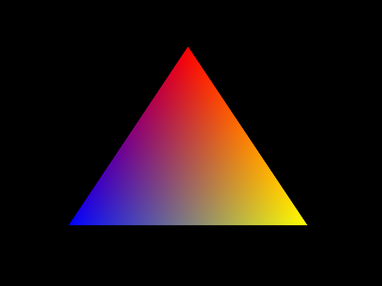

glue
====
glue is a C++ library that provides class wrappers for OpenGL 3 objects such as vertex buffer objects or shader programs. The library aims for ease of use but still requires some knowledge of the OpenGL pipeline. Take a look at [open.gl](http://open.gl) for an introduction to modern OpenGL.

glue currently includes [glad](https://github.com/Dav1dde/glad) to load OpenGL 3.3 (core) functions.

Installation
------------
1. Install dependencies:
    - glm
    - libpng (optional)
    - Qt5 (optional)
    - gflw3 (for samples)
2. Build and Install
```
cmake
make
make install
```

Usage
-----
The following example renders a colored triangle:
```c++
std::string vertexShader = "#version 330\n"
    "in vec2 position;\n"
    "in vec3 color;\n"
    "out vec3 fs_color;\n"
    "void main()\n"
    "{\n"
        "fs_color = color;\n"
        "gl_Position = vec4(position, 0.0, 1.0);\n"
    "}\n";

std::string fragmentShader = "#version 330\n"
    "in vec3 fs_color;\n"
    "out vec4 out_color;\n"
    "void main()\n"
    "{\n"
        "out_color = vec4(fs_color, 1.0);\n"
    "}\n";
auto program = new GlProgram(vertexShader, fragmentShader);
program->activate();

std::vector<glm::vec2> vertices = {
    glm::vec2(0.0f,  0.5f),
    glm::vec2(0.5f, -0.5f),
    glm::vec2(-0.5f, -0.5f)
};
std::vector<glm::vec3> colors = {
    glm::vec3(1.0f, 0.0f, 0.0f),
    glm::vec3(1.0f, 1.0f, 0.0f),
    glm::vec3(0.0f, 0.0f, 1.0f)
};

auto vbo = new GlVertexBuffer();
vbo->bind();
vbo->setData(GlBuffer::Usage::StaticDraw, vertices, colors);

auto vao = new GlVertexArray();
vao->bind();
vao->setVertexData(*vbo);
vao->draw(GlVertexArray::Primitive::Triangles);
```

